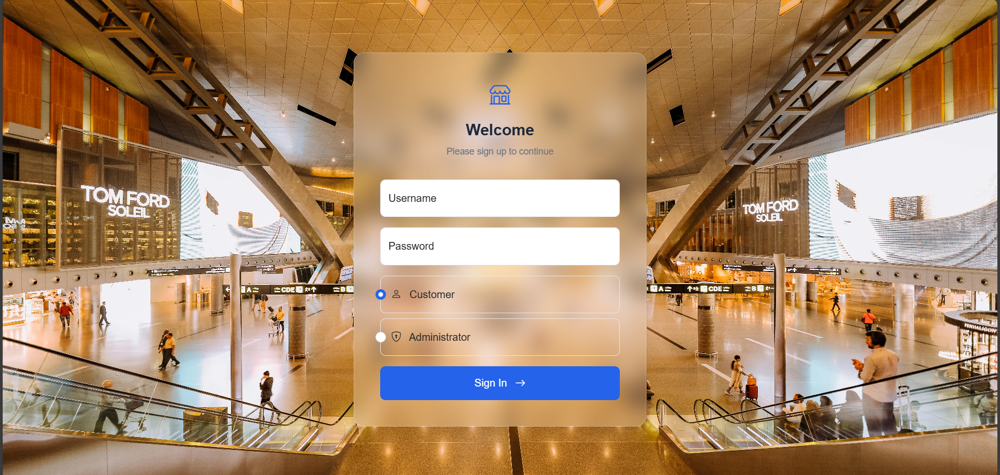
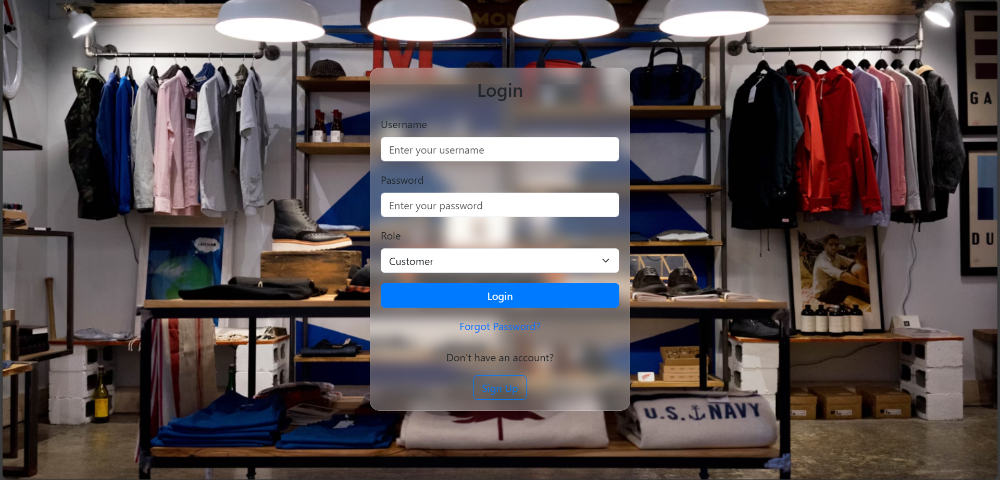
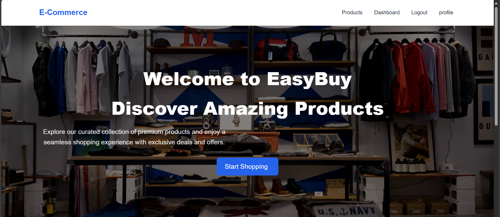
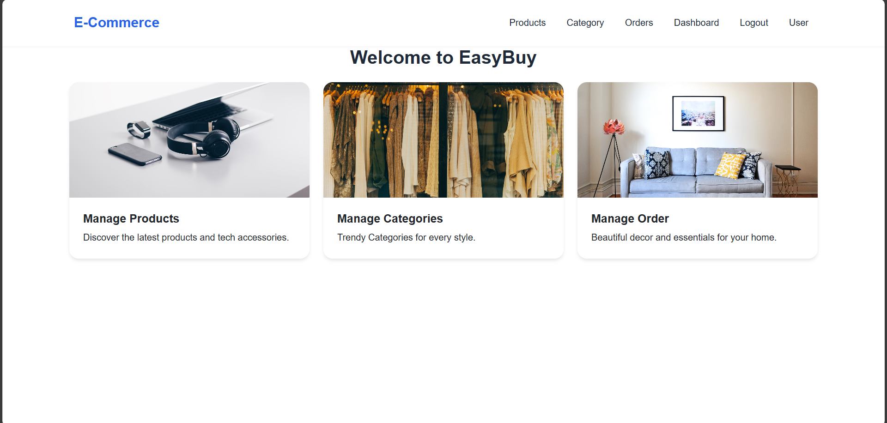
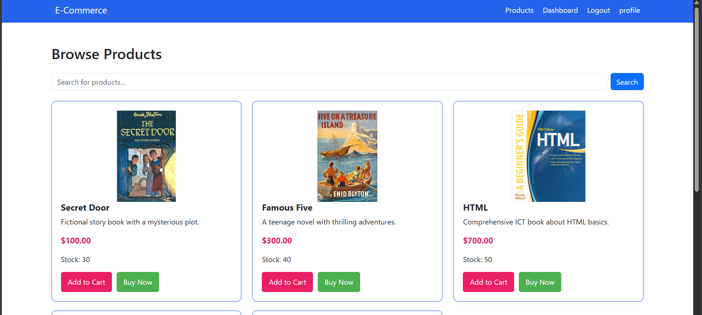
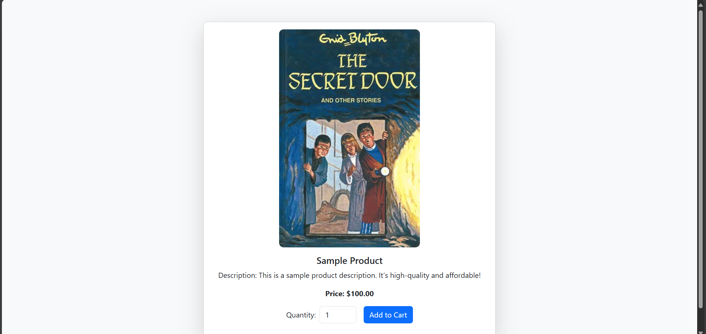

# E-Commerce Web Application

## Project Description
This is a fully functional e-commerce web application developed using **JavaEE**, **JDBC Connection Pooling**, and **JSP**. The application includes features for both administrators and customers, providing a comprehensive solution for managing products, user accounts, orders, and shopping carts.

## Features

### Administrator Features
1. **Product Management**
    - Add, view, update, and delete products.
2. **Category Management**
    - Add, view, update, and delete product categories.
3. **Order Management**
    - View all orders placed by customers.


### Customer Features
1. **User Authentication**
    - Registration, login, and logout.
2. **Product Browsing**
    - View products by category, search by name, and sort by price.
3. **Shopping Cart**
    - Add products to the cart, update quantities, and remove products.
4. **Order Placement**
    - Place orders and view order history.
5. **User Profile Management**
    - Update personal information and password.

## Database Setup
1. Create a MySQL database named `ecommerce`.
2. Tables:
    - `products`
    - `categories`
    - `users`
    - `orders`
    - `order_details`
    - `cart`

## Technologies Used
- **JavaEE** for backend development.
- **JSP** for front-end user interfaces.
- **JDBC Connection Pool** (e.g., Apache DBCP, HikariCP, or Tomcat connection pool) for efficient database connectivity.
- **MySQL** for database management.
- **CSS** and optional **Bootstrap** for styling.

## Folder Structure
```
src/
├── main/
│   ├── java/
│   │   └── com.example.ecommerce/
│   │       ├── servlets/          # Servlets for application features
│   │                
│   └── webapp/
│       ├── WEB-INF/               # JavaScript files
│       ├── images/                # Images
│       ├── dashboardAdmin.jsp
│       ├── dashboardCustomer.jsp
│       ├── product.jsp
│       ├── cart.jsp
│       └── ...
```

## Installation Instructions

1. Clone the repository:
   ```bash
   git clone https://github.com/kavindisathsarani/E-Commerce-Application.git
   ```

2. Import the project into your preferred IDE (e.g., IntelliJ IDEA, Eclipse).

3. Configure the database:
    - Set up the MySQL database using the `ecommerce.sql` script.
    - Update database connection settings in the `DataSource` configuration.

4. Deploy the application on a JavaEE-supported server (e.g., Apache Tomcat).

5. Access the application via `http://localhost:8080/ecommerce_jsp/`.

## Screenshots

### Sign Up Page


### Login Page


### Customer Dashboard


### Admin Dashboard


### Product Browsing


### Add To Cart


## Video Demonstration
Watch the video demonstration of the application here: [YouTube Link](https://www.youtube.com/watch?v=your_video_link)

## Bonus Features
- Advanced search with filters by price range, category, and keywords.
- User roles and permissions (e.g., admin, customer).


## Author
Developed by **Kavindi Sathsarani**.
